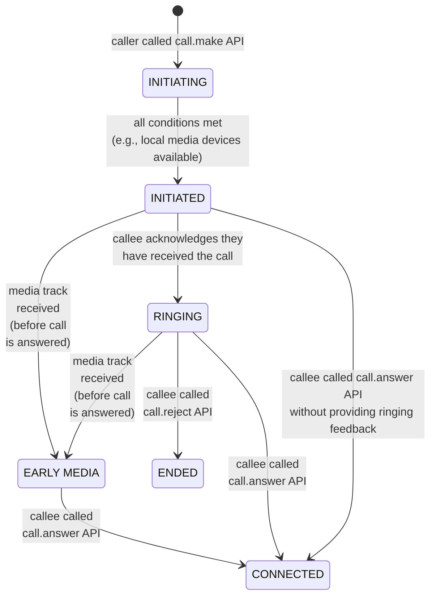
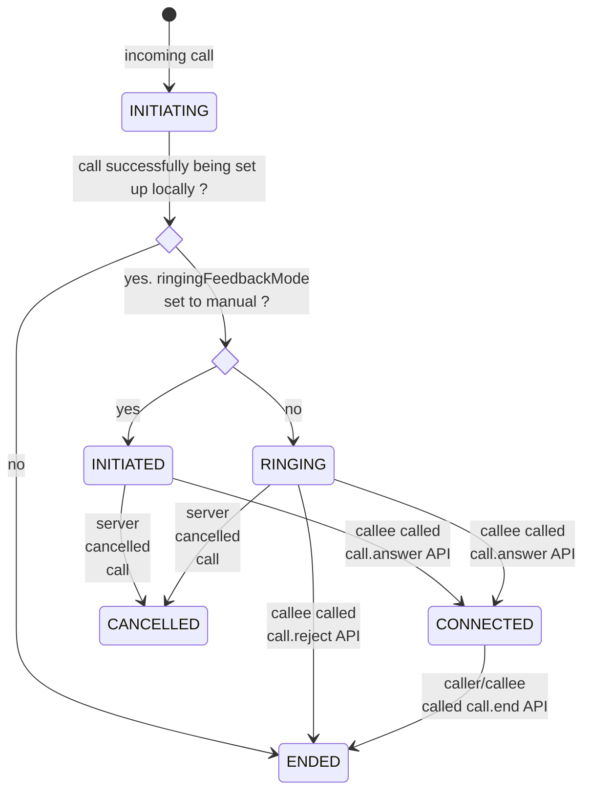
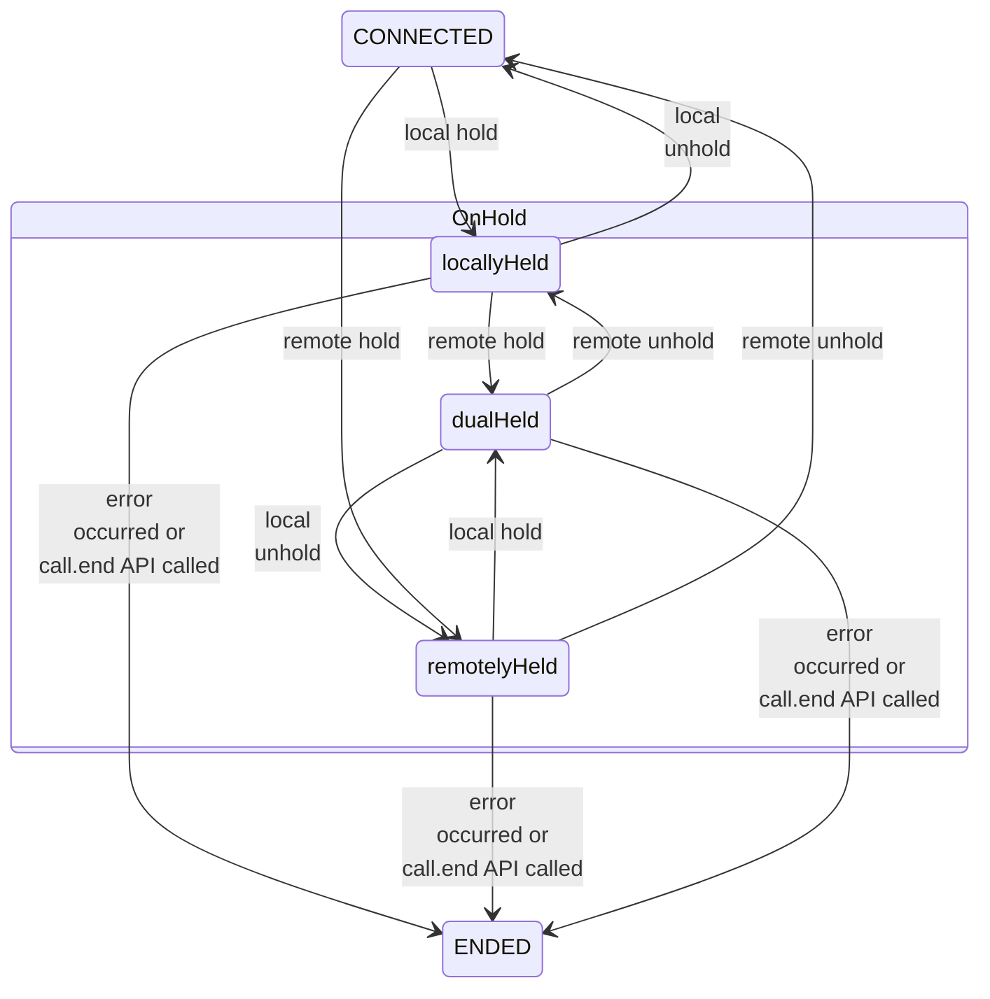

# Call States

Any given Call instance has its information persisted in the SDK state associated with the application. Therefore the application can use the `call.getById` or `call.getAll` functions to get information of a particular call or calls.
Call information persists beyond the call's lifetime.

To see the supported Call states, see `api.call.states` in API documentation.

When an operation is performed on a call, it can transition to another state.
The operation can either be explicitly initiated by the user or implicitly triggered by the SDK (for example as a result of internal error or a server response).
The scenarios mentioned below are just few examples and therefore they do not cover all possibilities.

## Caller's Call States

From the Caller's perspective, we have the following state transitions:

- If current state is '**Initiating**' then it can transition to '**Initiated**' or '**Ended**'.

  Going into '**Initiated**' state is the result of a user making a call
  and the call is successfully setup locally. The Call is now waiting to be received on the remote side, and will be updated again when a response is received.

  Going into '**Ended**' state is the result of the user hanging up at that very moment or an error being reported. If there is an error reported, the application can act accordingly, i.e., show the error, suggest a solution, etc.

- If current state is '**Initiated**' then it can transition to '**Ringing**', '**Early Media**', '**Connected**', or '**Ended**'.

  Going into '**Ringing**' state is an indication that the server successfully delivered the call request to the remote endpoint. Therefore, the application can play audio sounds to indicate the ringing, as well as visually convey this state.

  Going into '**Early Media**' state is the result of the caller receiving a media track, without the call having been answered. An application may playback/render the incoming track when going into this state.

  Going into '**Connected**' state directly from the '**Initiated**' state is the result of the remote party answering the call, whilst not providing any ringing feedback prior to answering the call. An application may use this state to enable any of the mid-call operations (e.g., call hold, add media, etc.).

  Going into '**Ended**' state is the result of the caller hanging up, or encountering an unrecoverable error which causes the call to end.

- If current state is '**Early Media**', then it can transition to '**Connected**' or '**Ended**'.

  Going into '**Connected**' state is the result of the callee answering the call. An application may use this state to enable any of the mid-call operations.

  Going into '**Ended**' state is the result of caller hanging up, or encountering an unrecoverable error which causes the call to end.

- If current state is '**Ringing**' then it can transition to '**Early Media**', '**Connected**' or '**Ended**'.

  Going into '**Early Media**' state is the result of the caller receiving a media track, without the call having been answered. An application may playback/render the incoming track when going into this state.

  Going into '**Connected**' state is the result of the callee answering the call. An application may use this state to enable any of the mid-call operations.

  Going into '**Ended**' state is the result of caller hanging up, or the callee rejecting the incoming call, or running into an error.

* If current state is '**Connected**', the call's state can transition to: '**On Hold**' or '**Ended**'.

  Going into '**On Hold**' state is the result of either the caller or the callee (or both) putting the call on hold. When a Call is set on hold, it means its media directions were set to inactive (media isn't being sent or received). While a call is on hold, certain other mid-call operations are not possible, such as adding media. An application may make use of this state to report which party initiated the action, as well as to disable/enable certain functionality. See `Caller/Callee's State Diagram for Midcall operations` diagram for more details.

  Going into '**Ended**' state is the result of the caller, or callee, hanging up the call, or an error being thrown.

* If current state is '**On Hold**', then it can transition to '**Connected**', '**On Hold**' or '**Ended**'.

  Going into '**Connected**' state is the result of re-establishing the sending and receiving of media tracks by the party who initially put the call on hold. If both parties put the call on hold, then both have to unhold the call in order to go into this state.

  Going into '**On Hold**' state is the result of the other party performing a hold operation (i.e. a double hold). See `Caller/Callee's State Diagram for Midcall operations` diagram for more details.

  Going into '**Ended**' state is the result of the caller, or callee, hanging up the call, or an error being thrown.

## Caller's State Diagram for Call Establishment

Below you'll find a diagram showing call state transitions for an outgoing call (i.e. from caller's perspective).

- Note that from any state, the call may go to `Ended` state, via API invocation (e.g. caller or callee ends the call) or due to an irrecoverable error happening.
- Note that backend components may prevent call state going into Ringing if callee's ringingFeedbackMode is set to manual. This is the case for transitioning from '**Initiated**' state to '**Connected**'.

  
<strong>State transitions in an outgoing call (Call Establishment)</strong>

## Callee's Call States

From the Callee's perspective, we have the following state transitions:

- If current state is '**Initiating**' then it can transition to '**Initiated**', '**Ringing**' or '**Ended**'.

  Going into '**Initiated**' state is the result of a user receiving a call and the call is successfully setup locally. The Call is now in a state where it can be either accepted/answered or rejected by the user.

  Going into **Ringing** state occurs when callee's SDK configuration item `config.call.ringingFeedbackMode` is set to `auto`. This is the default value. In this case the callee's SDK will automatically send the ringing feedback without needing any interaction from the application.

  Going into '**Ended**' state is the result of the user hanging up at that very moment or an error being reported. If there is an error reported, the application can act accordingly, i.e., show the error, suggest a solution, etc.

- If current state is '**Initiated**' then it can transition to '**Ringing**', '**Connected**', '**Ended**' or '**Cancelled**'.

  Going into '**Ringing**' state is reached when callee's SDK config `config.call.ringingFeedbackMode` was set to `manual` and the application initiated the ringing request, by calling `call.sendRingingFeedback` API. If application decides to not to trigger ringing feedback, the call will stay in **Initiated** state but it still can be answered by user.

  Going into '**Connected**' state is the result of callee answering the incoming call right away (before any ringing is triggered).

  Going into '**Ended**' state is the result of the caller, or callee, hanging up the call, or an error being thrown.

  Going into '**Cancelled**' state is an indication that the incoming call request was cancelled by the server for various reasons (e.g. caller hung up or callee answered the call from another device). An application can check for any reported status and convey this to the callee.

- If current state is '**Ringing**' then it can transition to '**Connected**', '**Ended**', or '**Cancelled**'.

  Going into '**Connected**' state is the result of the callee answering the call. An application may use this state to enable any of the mid-call operations (e.g., call hold, add media, etc.).

  Going into '**Ended**' state is the result of the caller, or callee, hanging up the call, or an error being thrown.

  Going into '**Cancelled**' state is an indication that the incoming call request was cancelled by the server for various reasons (e.g. caller hung up or callee answered the call from another device). An application can check for any reported status and convey this to the callee.

* If current state is '**Connected**', the call's state can transition to: '**On Hold**' or '**Ended**'.

  Going into '**On Hold**' state is the result of either the caller or the callee (or both) putting the call on hold. When a Call is set on hold, it means its media directions were set to inactive (media isn't being sent or received). While a call is on hold, certain other mid-call operations are not possible, such as adding media. An application may make use of this state to report which party initiated the action, as well as to disable/enable certain functionality. See `Caller/Callee's State Diagram for Midcall operations` diagram for more details.

  Going into '**Ended**' state is the result of the caller, or callee, hanging up the call, or an error being thrown.

* If current state is '**On Hold**', then it can transition to '**Connected**', '**On Hold**' or '**Ended**'.

  Going into '**Connected**' state is the result of re-establishing the sending and receiving of media tracks by the party who initially put the call on hold. If both parties put the call on hold, then both have to unhold the call in order to go into this state.

  Going into '**On Hold**' state is the result of the other party performing a hold operation (i.e. a double hold). See `Caller/Callee's State Diagram for Midcall operations` diagram for more details.

  Going into '**Ended**' state is the result of the caller, or callee, hanging up the call, or an error being thrown.

## Callee's State Diagram for Call Establishment

Below you'll find a diagram showing call state transitions for an incoming call (i.e. from callee's perspective).

- Note that from any state, the call may go to `Ended` state, via API invocation (e.g. caller or callee ends the call) or due to an irrecoverable error happening.

  
<strong>State transitions in an incoming call (Call Establishment)</strong>

  

## Caller/Callee's State Diagram for Midcall operations & Teardown

Below you'll find a diagram showing call state transitions, which apply to both caller and callee.

- From the diagram below, the only visible states observed by application are '**Connected**', '**On Hold**' & '**Ended**'. Any of the sub-states represented within the `OnHold` state, are mere logical representations that aid in understanding the dual nature of holding/unholding a call by either caller or callee.
- Local (or remote) hold actions are triggered by calling `call.hold` API by either callee or caller.
- Local (or remote) unhold actions are triggered by calling `call.unhold` API by either callee or caller.
- Note that from any state, the call may go to `Ended` state, via API invocation (e.g. caller or callee ends the call) or due to an irrecoverable error happening.

  
<strong>State transitions for midcall operations (for both Caller & Callee)</strong>

